# Todo List Management API 📝

🌟 Hello all! Welcome to my To Do List backend API testing. I used Swagger to test all my API endpoints. API for managing todo list, including user authentication and todo list management. 🌟

## Features ✨
Todo (Todo list related operations) 📎
- Todo CRUD Operations
  - Get All Todo List
  - Add/Create new Todo List
  - Delete Todo List
  - Update Todo List
User (User related operations) 👤
- User Authentication (Sign Up, Sign In)
- Email Verification
- Role-Based Access Control

## API Documentation 📃

The API documentation is available at: `http://localhost:5001/todolist/api-docs`

### API Testing Results (User Based Operations)

#### When using the API documentation, remember to change servers depending on which type of operation you'd like to use.
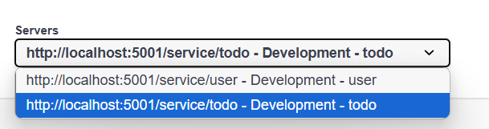

#### 1. User Sign Up 
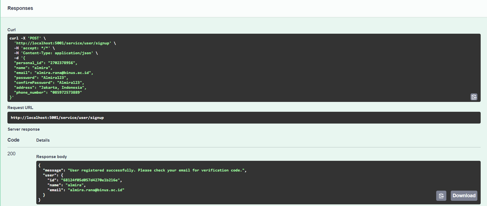
- **Endpoint**: POST `/service/user/signup`
- **Description**: Creates a new user account
- **Test Data**:
  ```json
  {
  "personal_id": "2702378956",
  "name": "almira",
  "email": "almira.rana@binus.ac.id",
  "password": "Almira123",
  "confirmPassword": "Almira123",
  "address": "Jakarta, Indonesia",
  "phone_number": "085972573889"
  }
  ```
- **Result**: User registered successfully. Please check your email for verification code.
 
<br>


#### 2. New User Verification

- **Endpoint**: POST `/service/user/verify-email`
- **Description**: Verifies user using a one-time passcode sent to their email.
- **Test Data**:
  ```json
  {
  "email": "almira.rana@binus.ac.id",
  "code": "476913"
  }
  ```
- **Result**: Email verified successfully

<br>


#### 3. User Sign In

- **Endpoint**: POST `/service/user/signin`
- **Description**: Authenticates user and returns access token
- **Test Data**:
  ```json
  {
  "email": "almira.rana@binus.ac.id",
  "password": "Almira123"
  }
  ```
- **Result**: Sign In successfully!

<br>

#### 4. User Sign In

- **Endpoint**: POST `/service/user/signin`
- **Description**: Authenticates user and returns access token
- **Test Data**:
  ```json
  {
  "email": "almira.rana@binus.ac.id",
  "password": "Almira123"
  }
  ```
- **Result**: Sign In successfully!

<br>

#### Before moving on to the next step, let's try to access the authorize feature in Swagger. The way this works is allow you to access admin-only operations.
1. Open Authorize Menu <br>
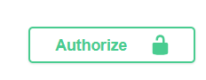

2. Retrieve your Access Token from Successful Sign in Message and Paste into the Authorization Menu. <br>
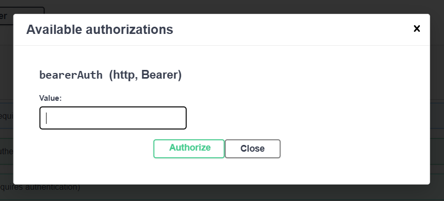

3. Authorize, then the menu should look like this. <br>
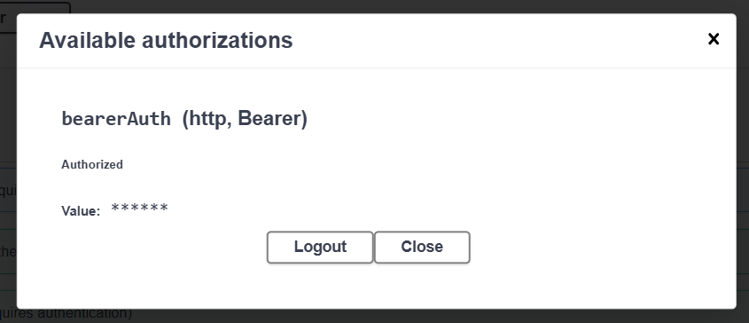

<br>

#### 5. Get Current User Information
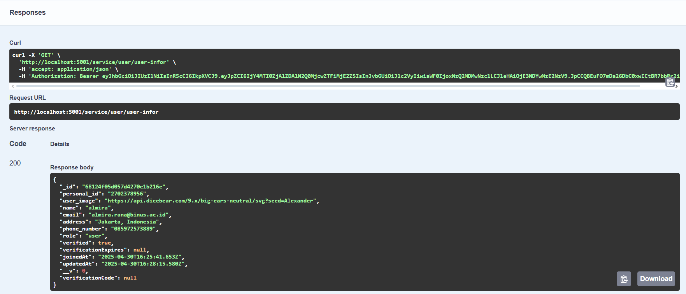
- **Endpoint**: GET `/service/user/user-infor`
- **Description**: Retrieves your account information.
- **Result**: 
 ```json
  {
  "_id": "68124f05d057d4270e1b216e",
  "personal_id": "2702378956",
  "user_image": "https://api.dicebear.com/9.x/big-ears-neutral/svg?seed=Alexander",
  "name": "almira",
  "email": "almira.rana@binus.ac.id",
  "address": "Jakarta, Indonesia",
  "phone_number": "085972573889",
  "role": "user",
  "verified": true,
  "verificationExpires": null,
  "joinedAt": "2025-04-30T16:25:41.653Z",
  "updatedAt": "2025-04-30T16:28:15.580Z",
  "__v": 0,
  "verificationCode": null
  }
  ```
<br>

#### 6. Get All Users
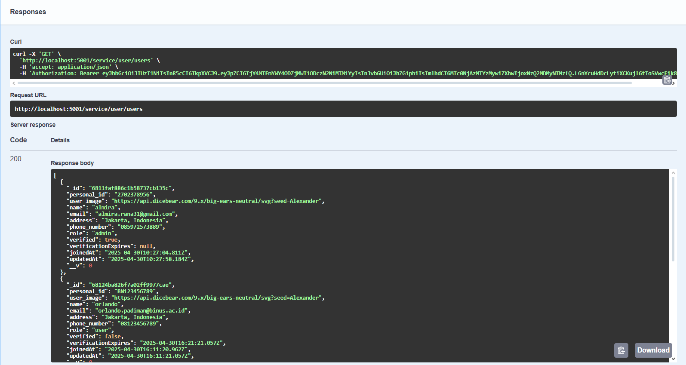
- **Endpoint**: GET `/service/user/users`
- **Description**: Retrieves data of all existing users in database.
- **Result**:
```json
[
  {
    "_id": "6811faf886c1b58737cb135c",
    "personal_id": "2702378956",
    "user_image": "https://api.dicebear.com/9.x/big-ears-neutral/svg?seed=Alexander",
    "name": "almira",
    "email": "almira.rana31@gmail.com",
    "address": "Jakarta, Indonesia",
    "phone_number": "085972573889",
    "role": "admin",
    "verified": true,
    "verificationExpires": null,
    "joinedAt": "2025-04-30T10:27:04.811Z",
    "updatedAt": "2025-04-30T10:27:58.184Z",
    "__v": 0
  },
  {
    "_id": "68124ba826f7a02ff9977cae",
    "personal_id": "BN123456789",
    "user_image": "https://api.dicebear.com/9.x/big-ears-neutral/svg?seed=Alexander",
    "name": "orlando",
    "email": "orlando.padiman@binus.ac.id",
    "address": "Jakarta, Indonesia",
    "phone_number": "08123456789",
    "role": "user",
    "verified": false,
    "verificationExpires": "2025-04-30T16:21:21.057Z",
    "joinedAt": "2025-04-30T16:11:20.962Z",
    "updatedAt": "2025-04-30T16:11:21.057Z",
    "__v": 0
  },
  {
    "_id": "68124be126f7a02ff9977cb2",
    "personal_id": "BN123456789",
    "user_image": "https://api.dicebear.com/9.x/big-ears-neutral/svg?seed=Alexander",
    "name": "orlando",
    "email": "test@example.com",
    "address": "Test Address",
    "phone_number": "1234567890",
    "role": "user",
    "verified": false,
    "verificationExpires": "2025-04-30T16:22:17.262Z",
    "joinedAt": "2025-04-30T16:12:17.161Z",
    "updatedAt": "2025-04-30T16:12:17.262Z",
    "__v": 0
  },
  {
    "_id": "68124f05d057d4270e1b216e",
    "personal_id": "2702378956",
    "user_image": "https://api.dicebear.com/9.x/big-ears-neutral/svg?seed=Alexander",
    "name": "almira",
    "email": "almira.rana@binus.ac.id",
    "address": "Jakarta, Indonesia",
    "phone_number": "085972573889",
    "role": "user",
    "verified": true,
    "verificationExpires": null,
    "joinedAt": "2025-04-30T16:25:41.653Z",
    "updatedAt": "2025-04-30T16:28:15.580Z",
    "__v": 0
  }
]
 ```
<br>

#### 7. Update User Details
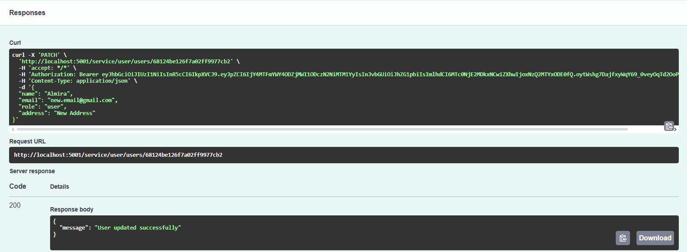
- **Endpoint**: PATCH `/service/user/users/{id}`
- **Description**: Updates data of currently existing user in database.
- **Test Data**:
  ```json
  id: 68124f05d057d4270e1b216e
  {
  "name": "Ally",
  "email": "almira.rana@binus.ac.id",
  "role": "admin",
  "address": "Wollongong, Australia",
  "phone_number": "081234567890"
  }
  ```
- **Result**: User updated successfully
<br>

#### 8. Delete User
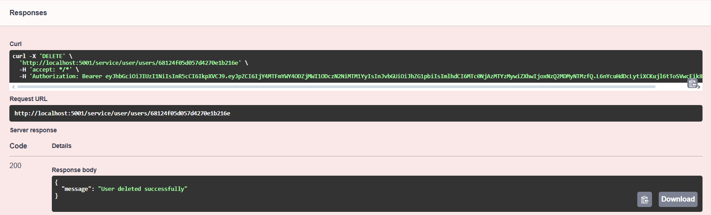
- **Endpoint**: DELETE `/service/user/users/{id}`
- **Description**: Deletes all data of currently chosen existing user in database.
- **Test Data**:
  ```json
  id: 68124f05d057d4270e1b216e
  ```
- **Result**: User deleted successfully

#### 9. Other POST Operations for User
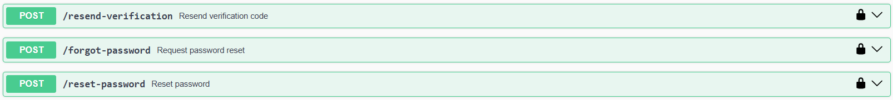
- Resend verification email if previously send OTP has expired.
- Forgot password if user does not remember password and would like to request a reset link.
- Reset password using OTP from reset password link.
<br>

### API Testing Results (Todo Based Operations)

#### 1. Create Todo
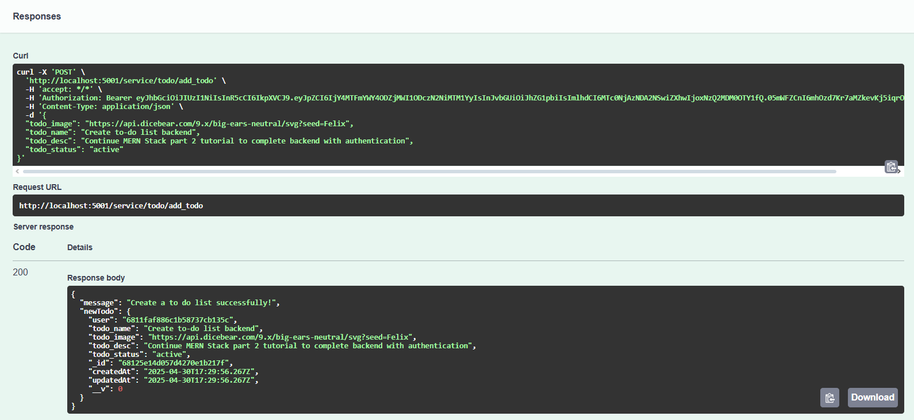
- **Endpoint**: POST `/service/todo/add_todo`
- **Description**: Creates a new todo item
- **Test Data**:
  ```json
  {
  "todo_image": "https://api.dicebear.com/9.x/big-ears-neutral/svg?seed=Felix",
  "todo_name": "Create to-do list backend",
  "todo_desc": "Continue MERN Stack part 2 tutorial to complete backend with authentication",
  "todo_status": "active"
  }
  ```
- **Result**: Create a to do list successfully!
<br>

#### 2. Get All Todos

- **Endpoint**: GET `/service/todo/get_all`
- **Description**: Retrieves all todos for the authenticated user
- **Result**: 
```json
[
  {
    "_id": "67daa222d4e6318def75d44b",
    "todo_name": "Checkpoint 2 WADS Final Project",
    "todo_image": "https://api.dicebear.com/9.x/icons/svg?seed=Katherine",
    "todo_desc": "Check Trello to see what to do for the WADS Checkpoint 2",
    "todo_status": "active",
    "createdAt": "2025-03-19T10:53:22.737Z",
    "updatedAt": "2025-03-19T10:57:32.518Z",
    "__v": 0
  },
  {
    "_id": "68125e14d057d4270e1b217f",
    "user": "6811faf886c1b58737cb135c",
    "todo_name": "Create to-do list backend",
    "todo_image": "https://api.dicebear.com/9.x/big-ears-neutral/svg?seed=Felix",
    "todo_desc": "Continue MERN Stack part 2 tutorial to complete backend with authentication",
    "todo_status": "active",
    "createdAt": "2025-04-30T17:29:56.267Z",
    "updatedAt": "2025-04-30T17:29:56.267Z",
    "__v": 0
  }
]
```
<br>

#### 3. Update Todo
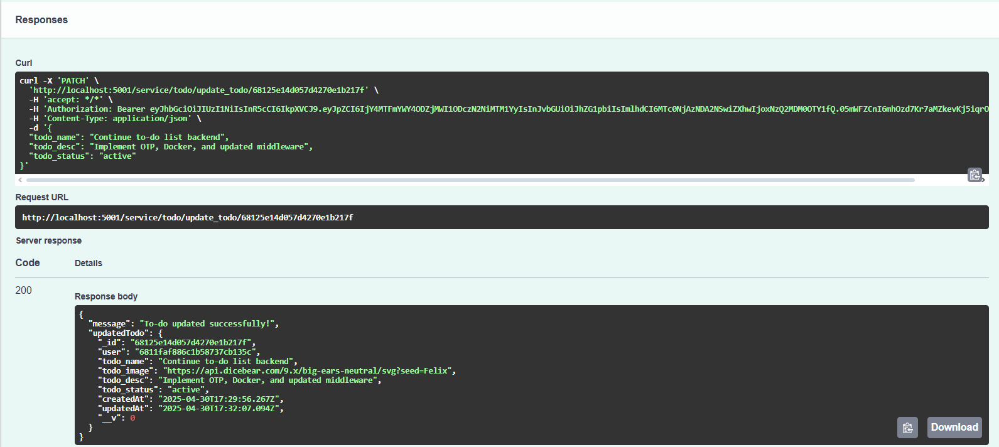
- **Endpoint**: PATCH `/service/todo/update_todo/{id}`
- **Description**: Updates an existing todo item
- **Test Data**:
  ```json
  id: 68125e14d057d4270e1b217f
  {
  "todo_name": "Continue to-do list backend",
  "todo_desc": "Implement OTP, Docker, and updated middleware",
  "todo_status": "active"
  }
  ```
- **Result**: To-do updated successfully!
<br>

#### 4. Delete Todo
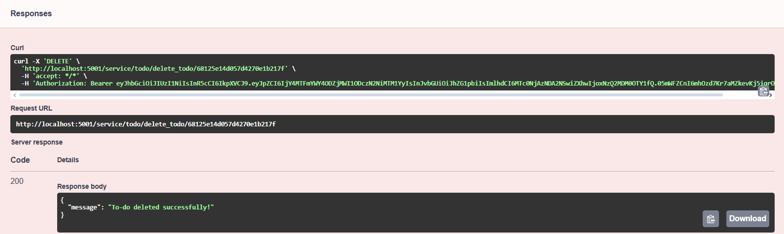
- **Endpoint**: DELETE `/service/todo/delete_todo/{id}`
- **Description**: Deletes a todo item
- **Test Data**:
  ```json
  id: 68125e14d057d4270e1b217f
  ```
- **Result**: To-do deleted successfully!
<br>

## Setup and Installation 💻

1. Clone the repository
2. Install dependencies:
   ```bash
   npm install
   ```
3. Create a `.env` file with the required environment variables
4. Start the application:
   ```bash
   npm start
   ```

## Docker Deployment 🐳

1. Build and start the containers:
   ```bash
   docker-compose up --build
   ```

Docker up and running will look like this in Docker Desktop. It will be accessible in `http://localhost:5001/todolist/api-docs`
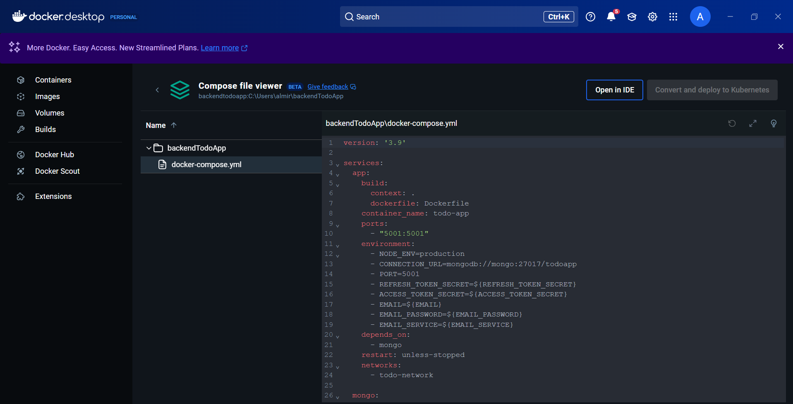
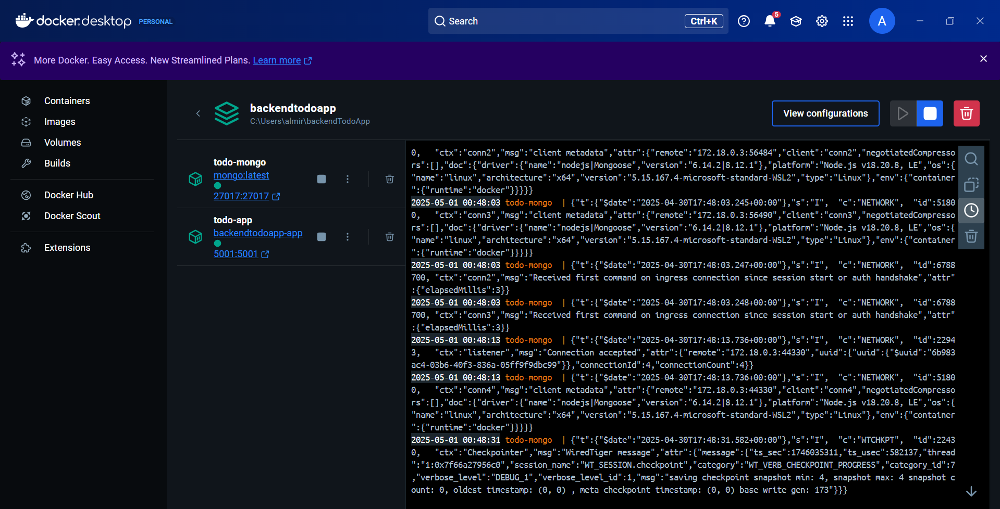


## Environment Variables

Required environment variables:
```
CONNECTION_URL = your-mongodb-connection-url
PORT = 5001

# JWT config
REFRESH_TOKEN_SECRET= your-refresh-token
ACCESS_TOKEN_SECRET= your-access-token

# email Configuration (for email verification and password reset)
EMAIL=your-email@emai.com
EMAIL_PASSWORD= your-email-app-password (not your real password)
EMAIL_SERVICE=gmail

# rate Limiting
RATE_LIMIT_WINDOW_MS=900000  # 15 minutes
RATE_LIMIT_MAX_REQUESTS=100  # 100 requests per window

EMAIL_HOST=smtp.gmail.com
EMAIL_PORT=587
EMAIL_SECURE=false
EMAIL_USER=your-email@email.com
EMAIL_FROM=email@email.com
APP_URL=http://localhost:5001
```
