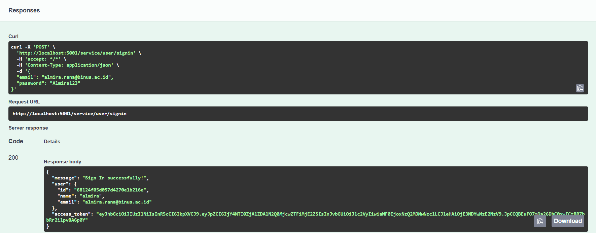
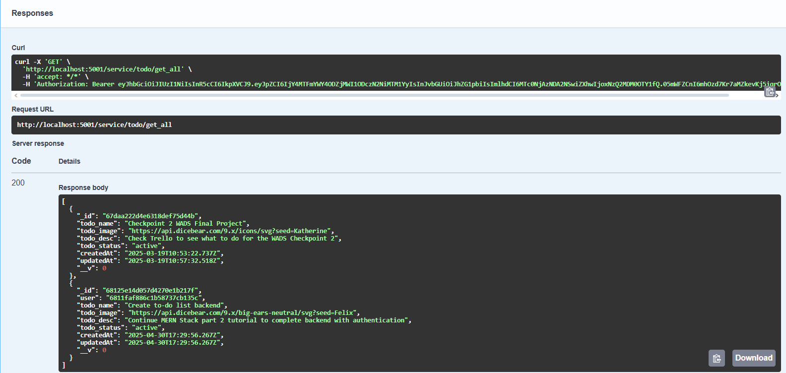

# Todo List Backend Application

A robust backend application for managing todo lists with user authentication and role-based access control.

## Features

- User Authentication (Sign Up, Sign In)
- Email Verification
- Todo CRUD Operations
- Role-Based Access Control
- Rate Limiting
- API Documentation with Swagger

## API Documentation

The API documentation is available at: `http://localhost:5001/todolist/api-docs`

### API Testing Results

#### 1. User Sign Up

- **Endpoint**: POST `/service/user/signup`
- **Description**: Creates a new user account
- **Test Data**:
  ```json
  {
    "personal_id": "BN12345678",
    "name": "Test User",
    "email": "test@example.com",
    "password": "Test123",
    "confirmPassword": "Test123",
    "address": "Test Address",
    "phone_number": "1234567890"
  }
  ```
- **Result**: Successfully created user account and sent verification email

#### 2. User Sign In

- **Endpoint**: POST `/service/user/signin`
- **Description**: Authenticates user and returns access token
- **Test Data**:
  ```json
  {
    "email": "test@example.com",
    "password": "Test123"
  }
  ```
- **Result**: Successfully authenticated and received access token

#### 3. Create Todo

- **Endpoint**: POST `/service/todo/add_todo`
- **Description**: Creates a new todo item
- **Test Data**:
  ```json
  {
    "todo_name": "Complete Project",
    "todo_desc": "Finish the todo list application",
    "todo_status": "active"
  }
  ```
- **Result**: Successfully created todo item

#### 4. Get All Todos

- **Endpoint**: GET `/service/todo/get_all`
- **Description**: Retrieves all todos for the authenticated user
- **Result**: Successfully retrieved list of todos

#### 5. Update Todo

- **Endpoint**: PATCH `/service/todo/update_todo/{id}`
- **Description**: Updates an existing todo item
- **Test Data**:
  ```json
  {
    "todo_name": "Updated Todo",
    "todo_status": "finished"
  }
  ```
- **Result**: Successfully updated todo item

#### 6. Delete Todo

- **Endpoint**: DELETE `/service/todo/delete_todo/{id}`
- **Description**: Deletes a todo item
- **Result**: Successfully deleted todo item

## Setup and Installation

1. Clone the repository
2. Install dependencies:
   ```bash
   npm install
   ```
3. Create a `.env` file with the required environment variables
4. Start the application:
   ```bash
   npm start
   ```

## Docker Deployment

1. Build the containers:
   ```bash
   docker-compose build
   ```

2. Start the containers:
   ```bash
   docker-compose up
   ```

## Environment Variables

Required environment variables:
```
PORT=5001
CONNECTION_URL=mongodb://mongo:27017/todoapp
REFRESH_TOKEN_SECRET=your_refresh_token_secret
ACCESS_TOKEN_SECRET=your_access_token_secret
EMAIL=your_email@gmail.com
EMAIL_PASSWORD=your_app_password
EMAIL_SERVICE=gmail
```

## Security Features

- JWT Authentication
- Password Hashing
- Email Verification
- Role-Based Access Control
- Rate Limiting
- Input Validation
- CORS Protection

## API Rate Limiting

- Maximum requests: 100 per 15 minutes
- Configurable through environment variables:
  - `RATE_LIMIT_WINDOW_MS`
  - `RATE_LIMIT_MAX_REQUESTS`
